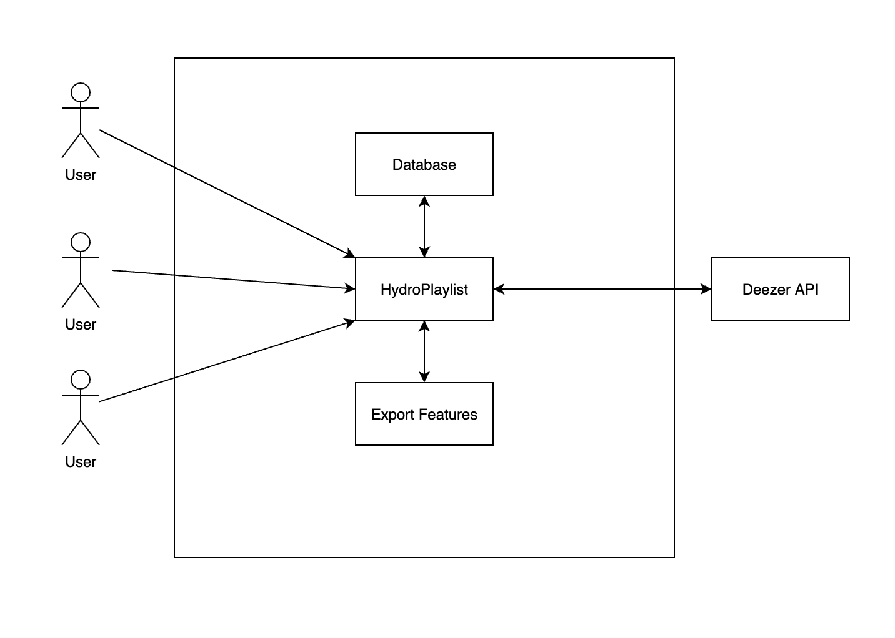

# HydroPlaylist
### Abstract
A user-based web application in which users will be able to login and then choose a music genre or go with completely random choices.
It will play 30 second music snippets and give users the option to like or dislike the song. 
They will be presented with a like and dislike button and as soon as one is pressed it will go to the next song. 
The user can choose to stop whenever they want, and it will comprise a playlist of all the songs they liked. 
The users will be able to export the playlist from the web display or it can take them to the song specifically for a variety of music sites that will be linked on each row. 
It will also have data about the artist, the song, and how quickly they pressed the like button. 
They will be able to see other playlists they made that have been stored from their other runs. 
They will also be able to see other users who ended up with the same playlist as well and be able to browse other users’ playlists. 
Lastly, there will be a trending page which shows the songs with the most likes from users for different periods of time. 

### Project Relevance
The project will be implementing many of the areas of focus of the course. 
Implementing it will require using version control and project management to develop and work on the application as a team also giving experience in working as a group. 
It will also require testing and issue tracking as new features are implemented. 
The project will also offer the opportunity to work on building a graphical user interface and integrating a database for all of the data storage. 
All of these points and goals are important as they will help everyone on the team to learn how to collaborate on building and deploying a working piece of software.
### Conceptual Design
The project will be focused around using the Deezer API in order to obtain the music information and tracks that will be played and the data that will be used to comprise the playlist. 
The API is completely free to use and has all the data that is required. 
Requests will be made to get each song as the users are going through. 
The data will be updated after each song in order to have all of the data to make the playlist at the end. 
The application will be built using some kind of framework and will have user accounts that can use the application to generate playlists which will then be stored into a database to use in relation to the accounts. 
Page data will load specific to users and allow the browsing of previous playlists as well as the playlists of other users through the database. 
### Background
Project URL: https://github.com/JasonXhoxhi/Proposal

This is just a sample index page the users will hit after logging in. Currently just shows the header and then that there will be buttons displayed to seclect the type of music genre they will be sampling from.

Can be seen just by dragging the html file into a new tab of any browser.

## Resources
Deezer API: https://rapidapi.com/deezerdevs/api/deezer-1

Experience with web technologies such as but not limited to (php, html, javascript, css) or differnt frameworks if decided by the team such as (react, django)

Experice working with databases
### Whiteboard Proposal
